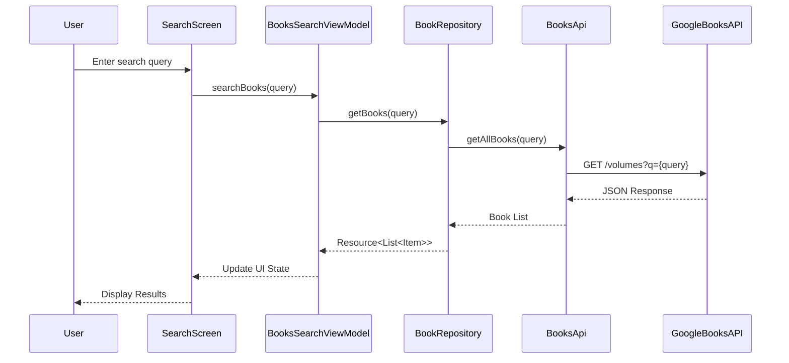

# ReadSphere 📚

<p align="center">
  
  
  
  
</p>

> **A modern Android book tracking and discovery application built with Jetpack Compose**

ReadSphere is an elegant Android application that empowers book enthusiasts to discover new books via the Google Books API, track their reading progress, manage personal libraries, and analyze reading statistics—all within a clean, intuitive Material Design 3 interface built entirely with Jetpack Compose.

---

## ✨ Key Features

| Feature | Description |
|---------|-------------|
| 🔐 **Authentication** | Secure email/password sign-up and login via Firebase Authentication |
| 🔍 **Book Discovery** | Search millions of books using the Google Books API |
| 📖 **Reading Tracker** | Track books by status: To Read, Currently Reading, Finished |
| 📊 **Reading Stats** | View reading analytics including books read and progress insights |
| ☁️ **Cloud Sync** | Access your library across devices with Firestore real-time sync |
| ⭐ **Ratings & Notes** | Rate books and add personal notes for each title |
| 🎨 **Material Design 3** | Modern UI following the latest Material Design guidelines |

---

## 🛠️ Tech Stack

### Frontend & UI
| Technology | Version | Purpose |
|------------|---------|---------|
| **Jetpack Compose** | 1.6.7 | Declarative UI toolkit |
| **Material 3** | 1.2.1 | Modern Material Design components |
| **Compose Navigation** | Latest | Type-safe screen navigation |
| **Coil** | 2.7.0 | Image loading with Compose support |
| **Material Icons Extended** | 1.6.7 | Comprehensive icon library |

### Backend & Data
| Technology | Version | Purpose |
|------------|---------|---------|
| **Firebase BOM** | 33.7.0 | Firebase services platform |
| **Firebase Auth** | Latest | User authentication |
| **Cloud Firestore** | Latest | NoSQL cloud database |
| **Retrofit** | 2.11.0 | REST API client |
| **OkHttp** | 5.0.0-alpha.11 | HTTP client |
| **Gson Converter** | 2.11.0 | JSON serialization |

### Architecture & DI
| Technology | Version | Purpose |
|------------|---------|---------|
| **Dagger Hilt** | 2.52 | Dependency injection |
| **Hilt Navigation Compose** | 1.2.0 | ViewModel injection in Compose |
| **Kotlin Coroutines** | 1.8.1 | Asynchronous programming |
| **Lifecycle ViewModel** | 2.9.1 | MVVM architecture support |

---

## 🏗️ Architecture

ReadSphere follows **MVVM (Model-View-ViewModel)** architecture with a clean separation of concerns:

```
┌─────────────────────────────────────────────────────────────┐
│                      PRESENTATION LAYER                      │
│  ┌─────────────────┐    ┌─────────────────────────────────┐ │
│  │   Composables   │◄───│         ViewModels              │ │
│  │  (UI Screens)   │    │  • HomeScreenViewModel          │ │
│  │                 │    │  • LoginScreenViewModel         │ │
│  │  • Home         │    │  • BooksSearchViewModel         │ │
│  │  • Search       │    │  • DetailsViewModel             │ │
│  │  • Details      │    └─────────────────────────────────┘ │
│  │  • Stats        │                    │                   │
│  │  • Update       │                    │                   │
│  └─────────────────┘                    │                   │
└─────────────────────────────────────────┼───────────────────┘
                                          │
┌─────────────────────────────────────────┼───────────────────┐
│                       DATA LAYER        │                   │
│  ┌─────────────────────────────────────┐│                   │
│  │           Repositories              ││                   │
│  │  • BookRepository (Google Books)    │◄                   │
│  │  • FireRepository (Firestore)       │                    │
│  └─────────────────┬───────────────────┘                    │
│                    │                                         │
│  ┌─────────────────▼───────────────────┐                    │
│  │         Data Sources                │                    │
│  │  • BooksApi (Retrofit)              │                    │
│  │  • Firebase Firestore               │                    │
│  └─────────────────────────────────────┘                    │
└─────────────────────────────────────────────────────────────┘
```

### Key Architectural Patterns

- **Repository Pattern**: Abstracts data sources from ViewModels
- **Dependency Injection**: Hilt manages all dependencies
- **Unidirectional Data Flow**: UI State flows down, events flow up
- **Reactive Streams**: StateFlow and Compose state for reactive UI

---

## 📂 Project Structure

```
app/src/main/java/com/bawp/freader/
├── 📁 components/
│   └── Components.kt           # Reusable UI components (ReaderLogo, InputFields, Cards, etc.)
│
├── 📁 data/
│   ├── DataOrException.kt      # Generic wrapper for data/loading/error states
│   └── Resource.kt             # Sealed class for API response handling
│
├── 📁 di/
│   └── AppModule.kt            # Hilt dependency injection module
│
├── 📁 model/
│   ├── MBook.kt                # App book model (Firestore document)
│   ├── MUser.kt                # User profile model
│   ├── Book.kt                 # Google Books API response model
│   ├── Item.kt                 # Single book item from API
│   ├── VolumeInfo.kt           # Book metadata (title, authors, description)
│   ├── ImageLinks.kt           # Book cover image URLs
│   └── ...                     # Additional API response models
│
├── 📁 navigation/
│   ├── ReaderNavigation.kt     # NavHost and navigation graph
│   └── ReaderScreens.kt        # Screen route definitions (enum)
│
├── 📁 network/
│   └── BooksApi.kt             # Retrofit interface for Google Books API
│
├── 📁 repository/
│   ├── BookRepository.kt       # Google Books API operations
│   └── FireRepository.kt       # Firestore database operations
│
├── 📁 screens/
│   ├── 📁 details/
│   │   ├── ReaderBookDetailsScreen.kt
│   │   └── DetailsViewModel.kt
│   ├── 📁 home/
│   │   ├── ReaderHomeScreen.kt
│   │   └── HomeScreenViewModel.kt
│   ├── 📁 login/
│   │   ├── ReaderLoginScreen.kt
│   │   ├── LoginScreenViewModel.kt
│   │   └── LoadingState.kt
│   ├── 📁 search/
│   │   ├── ReaderBookSearchScreen.kt
│   │   └── BooksSearchViewModel.kt
│   ├── 📁 stats/
│   │   └── ReaderStatsScreen.kt
│   ├── 📁 update/
│   │   └── ReaderBookUpdateScreen.kt
│   └── ReaderSplashScreen.kt
│
├── 📁 ui/
│   └── theme/                  # Material 3 theming
│
├── 📁 utils/
│   ├── Constants.kt            # API base URL and constants
│   └── Utils.kt                # Helper functions (date formatting, etc.)
│
├── MainActivity.kt             # Single activity entry point
└── ReaderApplication.kt        # Hilt application class
```

---

## 📱 Screen Flow

```
                           ┌──────────────────┐
                           │   SplashScreen   │
                           │   (Animation)    │
                           └────────┬─────────┘
                                    │
                    ┌───────────────┴───────────────┐
                    │                               │
              Not Logged In                   Already Logged In
                    │                               │
                    ▼                               ▼
           ┌────────────────┐              ┌────────────────┐
           │  LoginScreen   │              │   HomeScreen   │◄──────────┐
           │                │              │                │           │
           │ • Email/Pass   │              │ • Reading Now  │           │
           │ • Sign Up      │──────────────►│ • Reading List │           │
           └────────────────┘              └───────┬────────┘           │
                                                   │                    │
                    ┌──────────────────────────────┼────────────────────┤
                    │                              │                    │
                    ▼                              ▼                    │
           ┌────────────────┐              ┌────────────────┐           │
           │  SearchScreen  │              │  StatsScreen   │           │
           │                │              │                │           │
           │ • Search Books │              │ • Total Books  │           │
           │ • View Results │              │ • Completed    │───────────┘
           └───────┬────────┘              └────────────────┘
                   │
                   ▼
           ┌────────────────┐              ┌────────────────┐
           │ DetailsScreen  │              │  UpdateScreen  │
           │                │              │                │
           │ • Book Info    │              │ • Add Notes    │
           │ • Save to List │              │ • Rate Book    │
           └────────────────┘              │ • Update Status│
                                           └────────────────┘
```

---

## 🔄 Data Flow Example: Book Search



---

## 🔥 Firebase Integration

### Authentication
ReadSphere uses Firebase Authentication for secure user management:

```kotlin
// Sign in flow
viewModel.signInWithEmailAndPassword(email, password) {
    navController.navigate(ReaderScreens.ReaderHomeScreen.name)
}

// Create account flow
viewModel.createUserWithEmailAndPassword(email, password) {
    navController.navigate(ReaderScreens.ReaderHomeScreen.name)
}
```

### Cloud Firestore Schema

**Collection: `books`**
| Field | Type | Description |
|-------|------|-------------|
| `id` | String | Document ID |
| `title` | String | Book title |
| `authors` | String | Comma-separated authors |
| `description` | String | Book description |
| `categories` | String | Book categories |
| `book_photo_url` | String | Cover image URL |
| `published_date` | String | Publication date |
| `page_count` | String | Number of pages |
| `rating` | Double | User rating (0-5) |
| `notes` | String | User's personal notes |
| `started_reading_at` | Timestamp | When reading started |
| `finished_reading_at` | Timestamp | When reading finished |
| `user_id` | String | Owner's Firebase UID |
| `google_book_id` | String | Google Books API ID |

---

## 💡 Key Implementation Details

### State Management with Resource Wrapper

```kotlin
sealed class Resource<T>(val data: T? = null, val message: String? = null) {
    class Success<T>(data: T) : Resource<T>(data)
    class Error<T>(message: String?, data: T? = null) : Resource<T>(data, message)
    class Loading<T>(data: T? = null) : Resource<T>(data)
}
```

### Dependency Injection with Hilt

```kotlin
@Module
@InstallIn(SingletonComponent::class)
object AppModule {
    @Singleton
    @Provides
    fun provideBookApi(): BooksApi {
        return Retrofit.Builder()
            .baseUrl(Constants.BASE_URL)
            .addConverterFactory(GsonConverterFactory.create())
            .build()
            .create(BooksApi::class.java)
    }

    @Singleton
    @Provides
    fun provideFireBookRepository() = FireRepository(
        queryBook = FirebaseFirestore.getInstance().collection("books")
    )
}
```

### Navigation with Compose

```kotlin
enum class ReaderScreens {
    SplashScreen,
    LoginScreen,
    CreateAccountScreen,
    ReaderHomeScreen,
    SearchScreen,
    DetailScreen,
    UpdateScreen,
    ReaderStatsScreen
}
```

---

## ⚙️ Setup & Installation

### Prerequisites
- Android Studio Hedgehog (2023.1.1) or later
- JDK 8 or higher
- Android SDK 35 (minimum SDK 29)

### Steps

1. **Clone the repository**
   ```bash
   git clone https://github.com/yourusername/readsphere.git
   cd readsphere
   ```

2. **Firebase Setup**
   - Create a project at [Firebase Console](https://console.firebase.google.com)
   - Enable **Email/Password Authentication**
   - Create a **Cloud Firestore** database
   - Download `google-services.json` and place it in `/app` directory

3. **Google Books API (Optional)**
   - Get an API key from [Google Cloud Console](https://console.cloud.google.com)
   - The app works without a key but has rate limits

4. **Build and Run**
   ```bash
   ./gradlew assembleDebug
   ```
   Or open in Android Studio and click Run

---

## 📦 Build Configuration

### SDK Versions
| Configuration | Value |
|---------------|-------|
| Compile SDK | 35 |
| Target SDK | 35 |
| Min SDK | 29 |
| Kotlin | 2.0.21 |
| Gradle Plugin | 8.10.1 |

### Key Dependencies
```groovy
// Compose BOM
implementation platform('androidx.compose:compose-bom:2024.02.00')

// Firebase
implementation platform('com.google.firebase:firebase-bom:33.7.0')
implementation 'com.google.firebase:firebase-auth-ktx'
implementation 'com.google.firebase:firebase-firestore-ktx'

// Hilt
implementation "com.google.dagger:hilt-android:2.52"
kapt "com.google.dagger:hilt-android-compiler:2.52"

// Networking
implementation 'com.squareup.retrofit2:retrofit:2.11.0'
implementation 'com.squareup.retrofit2:converter-gson:2.11.0'

// Image Loading
implementation 'io.coil-kt:coil-compose:2.7.0'
```

---

## 🚀 Future Roadmap

- [ ] **Dark Theme Support** - System-aware theming
- [ ] **Offline Mode** - Local caching with Room database
- [ ] **Reading Timer** - Track reading sessions
- [ ] **Barcode Scanner** - Add books by ISBN scan
- [ ] **Reading Goals** - Set and track yearly goals
- [ ] **Social Features** - Share and recommend books
- [ ] **Export/Import** - Backup library data
- [ ] **Widgets** - Home screen reading widgets

---

## 📄 License

This project is licensed under the **Apache License 2.0** - see the [LICENSE](LICENSE) file for details.

---

<p align="center">
  <b>ReadSphere</b> — Built with ❤️ using Jetpack Compose
</p>
