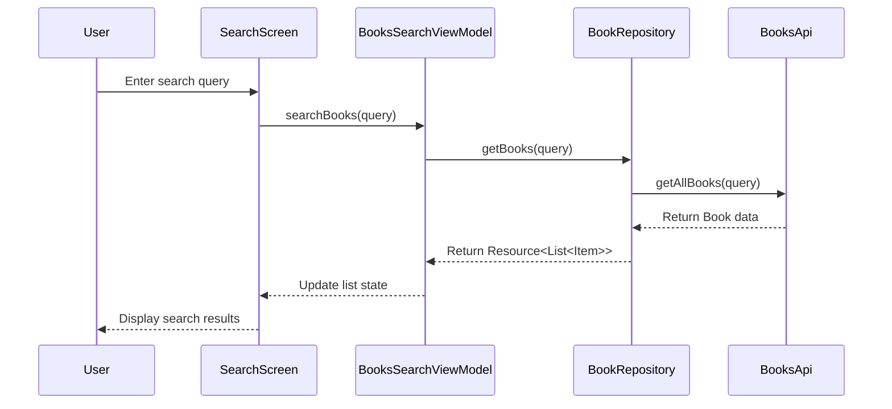

# ReadSphere: Your Personal Book Discovery & Reading Companion


> **A modern Android book management app built with Jetpack Compose and Firebase**

ReadSphere is an elegant Android application that empowers book enthusiasts to discover new books, track their reading progress, and manage personal libraries—all within a clean, intuitive interface built with Jetpack Compose and powered by Firebase.

## ✨ Key Features

- **Seamless Authentication**: Simple sign-up/login flow using Firebase Authentication
- **Book Discovery**: Search for books using the Google Books API
- **Personal Library Management**: Track books by reading status (to-read, currently reading, completed)
- **Reading Statistics**: View your reading activity and progress
- **Cloud Synchronization**: Access your library across multiple devices with Firestore integration
- **Modern Material 3 UI**: Clean, intuitive interface following Material Design 3 principles

## 🛠️ Tech Stack

### Frontend & UI
| Technology | Implementation |
|------------|----------------|
| **Jetpack Compose** | Declarative UI toolkit for building the entire interface |
| **Material Design 3** | Modern Material 3 components and theming |
| **Compose Navigation** | Single-activity app with type-safe navigation between screens |
| **Coil** | Image loading library optimized for Compose (v2.7.0) |

### Backend & Data
| Technology | Implementation |
|------------|----------------|
| **Firebase Authentication** | Email/password auth for user management |
| **Cloud Firestore** | NoSQL document database for user data and book collections |
| **Google Books API** | RESTful API for book search and metadata |
| **Retrofit 2.11.0** | Type-safe HTTP client for API communication |
| **OkHttp 5.0.0** | HTTP client with modern features |
| **Gson** | JSON parsing and serialization |

### Architecture & Patterns
| Component | Implementation |
|-----------|----------------|
| **MVVM Architecture** | Clear separation between UI, business logic, and data |
| **Repository Pattern** | Abstraction layer between data sources and ViewModels |
| **StateFlow & Flow** | Reactive streams for UI state management |
| **Kotlin Coroutines** | Asynchronous programming (v1.8.1) |
| **Dagger Hilt** | Dependency injection (v2.52) |

## 🏗️ Project Architecture

ReadSphere follows Clean Architecture principles with MVVM pattern:

### Architecture Layers

```
 ┌──────────────────────┐
 │                      │
 │   PRESENTATION       │──┐
 │   - Composables      │  │
 │   - ViewModels       │  │
 │                      │  │
 └──────────────────────┘  │
          │                │ UI Events &
 ┌────────▼───────────┐    │ State Updates
 │                    │    │
 │   DOMAIN           │    │
 │   - Models         │◄───┘
 │   - Data Wrappers  │
 │                    │
 └────────┬───────────┘
          │ Data Requests &
 ┌────────▼───────────┐ Responses
 │                    │
 │   DATA             │
 │   - Repositories   │
 │   - API Services   │
 │                    │
 └────────┬───────────┘
          │
 ┌────────▼───────────┐
 │                    │
 │   EXTERNAL         │
 │   - Firebase       │
 │   - Google Books   │
 │                    │
 └──────────────────────┘
```

## 📂 Project Structure

The codebase is organized by feature and layer:

```
app/src/main/java/com/bawp/freader/
├── MainActivity.kt          # Entry point of the application
├── ReaderApplication.kt     # Application class for Hilt
├── components/              # Reusable UI components
│   └── Components.kt        # Shared composables (Logo, Inputs, Cards, AppBar)
├── data/                    # Data handling utilities
│   ├── DataOrException.kt   # Loading/error/data wrapper for Firebase
│   └── Resource.kt          # API response wrapper (Success/Error/Loading)
├── di/                      # Dependency injection
│   └── AppModule.kt         # Hilt module (Retrofit, Firebase providers)
├── model/                   # Domain models
│   ├── Book.kt              # Google Books API response model
│   ├── Item.kt              # Individual book item from API
│   ├── VolumeInfo.kt        # Book details (title, authors, description)
│   ├── ImageLinks.kt        # Book cover image URLs
│   ├── MBook.kt             # App-specific book model for Firestore
│   └── MUser.kt             # User model
├── navigation/              # Navigation components
│   ├── ReaderNavigation.kt  # Navigation graph with all routes
│   └── ReaderScreens.kt     # Screen enum definitions
├── network/                 # API services
│   └── BooksApi.kt          # Google Books API Retrofit interface
├── repository/              # Data repositories
│   ├── BookRepository.kt    # Books API repository
│   └── FireRepository.kt    # Firebase Firestore operations
├── screens/                 # Application screens
│   ├── ReaderSplashScreen.kt    # App splash screen
│   ├── details/                 # Book details
│   │   ├── DetailsViewModel.kt
│   │   └── ReaderBookDetailsScreen.kt
│   ├── home/                    # Home screen
│   │   ├── HomeScreenViewModel.kt
│   │   └── ReaderHomeScreen.kt
│   ├── login/                   # Authentication
│   │   ├── LoadingState.kt
│   │   ├── LoginScreenViewModel.kt
│   │   └── ReaderLoginScreen.kt
│   ├── search/                  # Book search
│   │   ├── BooksSearchViewModel.kt
│   │   └── ReaderBookSearchScreen.kt
│   ├── stats/                   # Reading statistics
│   │   └── ReaderStatsScreen.kt
│   └── update/                  # Book status updates
│       └── ReaderBookUpdateScreen.kt
├── ui/                      # Theme and styling
└── utils/                   # Helper utilities
    ├── Constants.kt         # API base URL and constants
    └── Utils.kt             # Utility functions
```

## 🔄 Data Flow

ReadSphere implements a unidirectional data flow pattern:

1. **UI Events**: User interactions trigger events
2. **ViewModel Processing**: Events processed by ViewModels
3. **Repository Operations**: Data fetched/modified through repositories
4. **State Updates**: UI state updated with new data
5. **UI Rendering**: Composables re-render based on state changes

### Example Flow: Book Search



## 📊 Class Diagram

```
┌───────────────────────┐      ┌─────────────────────┐      ┌───────────────────┐
│       Home            │◄─────│  HomeScreenViewModel │◄─────│  FireRepository   │
├───────────────────────┤      ├─────────────────────┤      ├───────────────────┤
│ - HomeContent         │      │ - data: DataOrExc.  │      │ - queryBook       │
│ - BookListArea        │      ├─────────────────────┤      ├───────────────────┤
│ - ReadingRightNowArea │      │                     │      │ + getAllBooksFrom │
└───────────────────────┘      │                     │      │   Database()      │
                               └─────────┬───────────┘      └────────┬──────────┘
                                         │                          │
┌───────────────────────┐                │                          ▼
│    SearchScreen       │      ┌─────────▼───────────┐     ┌────────────────────┐
├───────────────────────┤      │ BooksSearchViewModel│     │     Firestore      │
│ - SearchForm          │◄─────├─────────────────────┤     │     (Firebase)     │
│ - BookList            │      │ - list: List<Item>  │     └────────────────────┘
│ - BookRow             │      │ - isLoading         │
└───────────────────────┘      ├─────────────────────┤
                               │ + searchBooks()     │
                               └─────────┬───────────┘
                                         │
                               ┌─────────▼───────────┐
                               │    BookRepository   │
                               ├─────────────────────┤
                               │ - api: BooksApi     │
                               ├─────────────────────┤
                               │ + getBooks()        │
                               │ + getBookInfo()     │
                               └─────────┬───────────┘
                                         │
                               ┌─────────▼───────────┐
                               │      BooksApi       │
                               ├─────────────────────┤
                               │ + getAllBooks()     │
                               │ + getBookInfo()     │
                               └─────────────────────┘
```

## 🌐 Firebase Integration

ReadSphere uses Firebase services for:

### Authentication
- Email/password authentication via `firebase-auth-ktx`
- Auth state persistence across app sessions
- User ID used to filter personal book collections

### Cloud Firestore
The app uses the following Firestore collections:
- **books**: User's personal book collection with:
  - Book metadata (title, authors, photo URL, description)
  - Reading status tracking via `started_reading_at` and `finished_reading_at` timestamps
  - Personal notes and ratings
  - `user_id` for user-specific filtering
  - `google_book_id` linking to Google Books API

### MBook Data Model
```kotlin
data class MBook(
    var id: String?,
    var title: String?,
    var authors: String?,
    var notes: String?,
    var photoUrl: String?,           // @PropertyName("book_photo_url")
    var categories: String?,
    var publishedDate: String?,      // @PropertyName("published_date")
    var rating: Double?,
    var description: String?,
    var pageCount: String?,          // @PropertyName("page_count")
    var startedReading: Timestamp?,  // @PropertyName("started_reading_at")
    var finishedReading: Timestamp?, // @PropertyName("finished_reading_at")
    var userId: String?,             // @PropertyName("user_id")
    var googleBookId: String?        // @PropertyName("google_book_id")
)
```

## 📱 Screen Navigation Flow

```
                          ┌───────────────┐
                          │  SplashScreen │
                          └───────┬───────┘
                                  │
                  ┌───────────────▼────────────────┐
                  │                                 │
           ┌──────▼─────┐             ┌─────────────▼─────┐
           │ LoginScreen │─── New ───►│CreateAccountScreen│
           └──────┬─────┘   User      └───────────────────┘
                  │
           Authenticated
                  │
           ┌──────▼──────────┐
           │ReaderHomeScreen │◄────────────────┐
           └───┬────┬────┬───┘                 │
               │    │    │                     │
     ┌─────────▼─┐  │    │    ┌───────────────┐│
     │SearchScreen│  │    └───►│ReaderStatsScreen│
     └──────┬────┘  │         └────────────────┘
            │       │
     ┌──────▼────┐  │
     │DetailScreen│  │
     └───────────┘  │
                    │
            ┌───────▼────────┐
            │  UpdateScreen  │
            └────────────────┘
```

## 💡 Key Implementation Highlights

### Smart State Management
ReadSphere uses custom wrapper classes to handle loading states, errors, and data:

```kotlin
// For API responses
sealed class Resource<T>(val data: T? = null, val message: String? = null) {
    class Success<T>(data: T): Resource<T>(data)
    class Error<T>(message: String?, data: T? = null): Resource<T>(data, message)
    class Loading<T>(data: T? = null): Resource<T>(data)
}

// For Firebase operations
data class DataOrException<T, Boolean, E : Exception?>(
    var data: T? = null,
    var loading: Boolean? = null,
    var e: E? = null
)
```

### Dependency Injection with Hilt
The `AppModule` provides singleton instances:
- **FireRepository**: Connected to Firestore "books" collection
- **BooksApi**: Retrofit instance for Google Books API (base URL: `https://www.googleapis.com/books/v1/`)

### Reusable UI Components
The `Components.kt` file contains shared composables:
- `ReaderLogo` - App branding
- `ReaderAppBar` - Consistent top app bar with navigation
- `EmailInput` / `PasswordInput` - Form inputs with validation
- `ListCard` - Book card for horizontal scrolling lists
- `BookRating` - Star rating display
- `FABContent` - Floating action button

## 🔧 Build Configuration

### Gradle Versions
```groovy
// Project-level build.gradle
ext {
    compose_compiler_version = '1.5.15'
    compose_version = '1.6.7'
    hilt_version = '2.52'
    kotlin_version = '2.0.21'
    ksp_version = '2.0.21-1.0.28'
}
```

### App Configuration
- **compileSdk**: 35
- **minSdk**: 29
- **targetSdk**: 35
- **Kotlin JVM Target**: 1.8
- **Compose Compiler Extension**: 1.5.15

### Key Dependencies
```groovy
// Firebase BOM
implementation platform('com.google.firebase:firebase-bom:33.7.0')
implementation 'com.google.firebase:firebase-auth-ktx'
implementation 'com.google.firebase:firebase-firestore-ktx'

// Compose
implementation "androidx.compose.ui:ui:$compose_version"
implementation "androidx.compose.material:material:$compose_version"
implementation "androidx.compose.material3:material3:1.2.1"

// Networking
implementation 'com.squareup.retrofit2:retrofit:2.11.0'
implementation 'com.squareup.okhttp3:okhttp:5.0.0-alpha.11'
implementation 'com.squareup.retrofit2:converter-gson:2.11.0'

// Image Loading
implementation 'io.coil-kt:coil-compose:2.7.0'

// Coroutines
implementation 'org.jetbrains.kotlinx:kotlinx-coroutines-core:1.8.1'
implementation 'org.jetbrains.kotlinx:kotlinx-coroutines-android:1.8.1'

// Hilt
implementation "com.google.dagger:hilt-android:$hilt_version"
implementation "androidx.hilt:hilt-navigation-compose:1.2.0"
```

## 🚀 Getting Started

### Prerequisites
- Android Studio Hedgehog (2023.1.1) or later
- JDK 17+
- Android SDK 35

### Setup Instructions

1. **Clone the repository**
   ```bash
   git clone https://github.com/yourusername/readsphere.git
   ```

2. **Create a Firebase project** at [console.firebase.google.com](https://console.firebase.google.com)
   - Enable Authentication (Email/Password provider)
   - Create a Firestore database
   - Download `google-services.json` and place it in the `app/` directory

3. **Configure Firestore Rules**
   ```javascript
   rules_version = '2';
   service cloud.firestore {
     match /databases/{database}/documents {
       match /books/{bookId} {
         allow read, write: if request.auth != null;
       }
     }
   }
   ```

4. **Open the project in Android Studio and sync Gradle**

5. **Run the app on an emulator or physical device**

## 🚀 Future Enhancements

- **Reading Timer**: Track actual reading time per session
- **Dark/Light Theme**: Support for system and custom themes
- **Reading Goals**: Set and track annual reading challenges
- **Offline Support**: Cache book data for offline browsing
- **Barcode Scanner**: Add physical books by scanning ISBN
- **Social Features**: Connect with friends and share recommendations
- **Export/Import**: Library data backup and restoration

## 📜 License

This project is licensed under the Apache License 2.0 - see the [LICENSE](LICENSE) file for details.

---

**ReadSphere** - Built with ❤️ using Jetpack Compose
