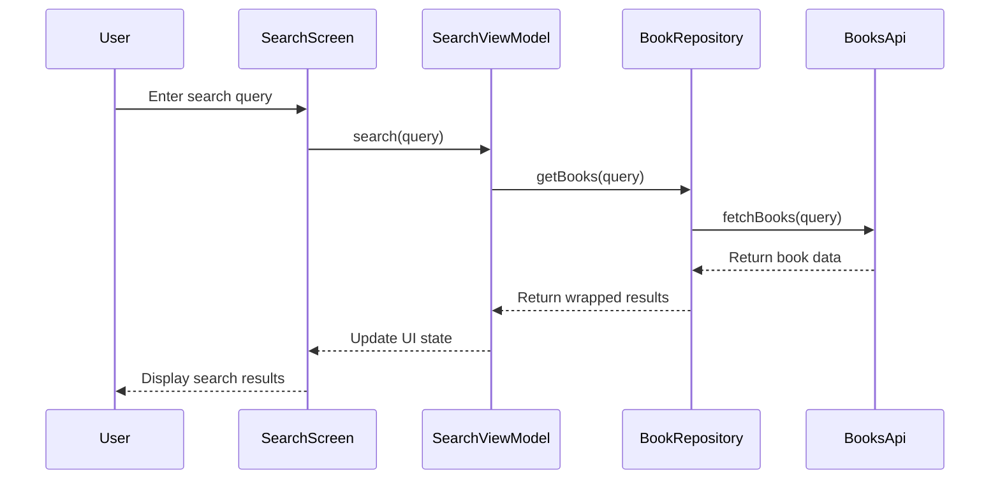

# BookVerse: Modern Book Discovery & Reading Companion


> **A comprehensive book management app built with modern Android development practices**

BookVerse is an elegant Android application that empowers book enthusiasts to discover new books, track their reading progress, manage personal libraries, and analyze reading habits—all within a clean, intuitive interface built with Jetpack Compose.

## ✨ Key Features

- **Seamless Authentication**: Simple sign-up/login flow using Firebase Authentication
- **Personalized Book Discovery**: Search for books using Google Books API with customized recommendations
- **Intelligent Library Management**: Track books by reading status (to-read, reading, completed)
- **Reading Analytics**: Visualize reading habits and progress statistics
- **Cloud Synchronization**: Access your library across multiple devices with Firestore integration
- **Modern Material UI**: Clean, intuitive interface following Material Design principles

## 🛠️ Tech Stack

### Frontend & UI
| Technology | Implementation |
|------------|----------------|
| **Jetpack Compose** | Declarative UI toolkit for building the entire interface |
| **Material Design Components** | Pre-built composables following Material Design guidelines |
| **Compose Navigation** | Single-activity app with type-safe navigation between screens |
| **Animations & Transitions** | Smooth transitions between screens for enhanced UX |
| **Coil** | Image loading library optimized for Compose with caching |

### Backend & Data
| Technology | Implementation |
|------------|----------------|
| **Firebase Authentication** | Email/password auth with security rules |
| **Cloud Firestore** | NoSQL document database for user data and book collections |
| **Google Books API** | RESTful API for book search and metadata |
| **Retrofit/OkHttp** | Type-safe HTTP client for API communication |
| **Gson** | JSON parsing and serialization |

### Architecture & Patterns
| Component | Implementation |
|-----------|----------------|
| **MVVM Architecture** | Clear separation between UI, business logic, and data |
| **Repository Pattern** | Abstraction layer between data sources and ViewModels |
| **Use Cases** | Business logic encapsulation for complex operations |
| **StateFlow & Flow** | Reactive streams for UI state management and data operations |
| **Kotlin Coroutines** | Asynchronous programming for background tasks |
| **Dagger Hilt** | Dependency injection throughout the application |

## 🏗️ Project Architecture

BookVerse follows Clean Architecture principles with MVVM pattern to ensure:
- **Testability**: Each layer can be tested independently
- **Separation of Concerns**: UI, business logic, and data sources are decoupled
- **Maintainability**: Changes in one layer don't affect others
- **Scalability**: Easy to add new features

### Architecture Layers

```
 ┌──────────────────────┐
 │                      │
 │   PRESENTATION       │──┐
 │   - Composables      │  │
 │   - ViewModels       │  │
 │                      │  │
 └──────────────────────┘  │
          │                │ UI Events &
 ┌────────▼───────────┐    │ State Updates
 │                    │    │
 │   DOMAIN           │    │
 │   - Use Cases      │◄───┘
 │   - Models         │
 │                    │
 └────────┬───────────┘
          │ Data Requests &
 ┌────────▼───────────┐ Responses
 │                    │
 │   DATA             │
 │   - Repositories   │
 │   - Data Sources   │
 │                    │
 └────────┬───────────┘
          │
 ┌────────▼───────────┐
 │                    │
 │   EXTERNAL         │
 │   - Firebase       │
 │   - Google Books   │
 │                    │
 └──────────────────────┘
```

## 📂 Project Structure

The codebase is organized by feature and layer for better maintainability:

```
app/src/main/java/com/bawp/freader/
├── components/          # Reusable UI components
├── data/                # Data handling
│   ├── DataOrException.kt   # Error/loading wrapper
│   └── Resource.kt          # API response wrapper
├── di/                  # Dependency injection
│   └── AppModule.kt         # Dagger Hilt modules
├── model/               # Domain models
│   ├── Book.kt              # Google Books API models
│   ├── MBook.kt             # App-specific book model
│   └── MUser.kt             # User model
├── navigation/          # Navigation components
│   ├── ReaderNavigation.kt  # Navigation graph
│   └── ReaderScreens.kt     # Screen definitions
├── network/             # API services
│   └── BooksApi.kt          # Google Books API interface
├── repository/          # Data repositories
│   ├── BookRepository.kt    # Books from API
│   └── FireRepository.kt    # Firebase operations
├── screens/             # Application screens
│   ├── details/             # Book details screen
│   ├── home/                # Home screen
│   ├── login/               # Auth screens
│   ├── search/              # Book search
│   ├── stats/               # Reading statistics
│   └── update/              # Book status updates
├── ui/                  # Theme and styling
└── utils/               # Helper functions
```

## 🔄 Data Flow

BookVerse implements a unidirectional data flow pattern with the following lifecycle:

1. **UI Events**: User interactions trigger events
2. **ViewModel Processing**: Events are processed by ViewModels
3. **Repository Operations**: Data is fetched/modified through repositories
4. **State Updates**: UI state is updated with new data
5. **UI Rendering**: Composables re-render based on state changes

### Example Flow: Book Search



## 📊 Class Diagram

```
┌───────────────────────┐      ┌─────────────────────┐      ┌───────────────────┐
│       HomeScreen      │◄─────│  HomeScreenViewModel │◄─────│  FireRepository   │
├───────────────────────┤      ├─────────────────────┤      ├───────────────────┤
│ - BookList            │      │ - userBooks: Flow   │      │ - firestore       │
│ - ReadingSection      │      ├─────────────────────┤      ├───────────────────┤
└───────────────────────┘      │ + getBooks()        │      │ + getUserBooks()  │
                               │ + updateBook()      │      │ + addBook()       │
                               └─────────┬───────────┘      └────────┬──────────┘
                                         │                          │
                                         ▼                          ▼
                               ┌─────────────────────┐     ┌────────────────────┐
                               │    BookRepository   │     │     Firestore      │
                               ├─────────────────────┤     │     (Firebase)     │
                               │ - booksApi          │     └────────────────────┘
                               ├─────────────────────┤
                               │ + getBooks()        │
                               │ + getBookInfo()     │
                               └─────────┬───────────┘
                                         │
                                         ▼
                               ┌─────────────────────┐
                               │      BooksApi       │
                               ├─────────────────────┤
                               │ + getAllBooks()     │
                               │ + getBookInfo()     │
                               └─────────────────────┘
```

## 🌐 Firebase Integration

BookVerse uses Firebase services for:

### Authentication
- Email/password authentication
- Auth state persistence
- Security rules for data access

### Cloud Firestore
The app uses the following Firestore collections:
- **users**: User profiles and preferences
- **books**: User's personal book collection with:
  - Reading status (to-read, reading, completed)
  - Start/finish dates
  - Personal notes and ratings
  - Reading statistics

### Security Rules
Custom Firestore security rules ensure users can only:
- Access their own data
- Create and modify their own book entries
- Read public book information

## 📱 Screen Navigation Flow

```
                          ┌───────────────┐
                          │  SplashScreen │
                          └───────┬───────┘
                                  │
                  ┌───────────────▼────────────────┐
                  │                                 │
           ┌──────▼─────┐             ┌─────────────▼─────┐
           │ LoginScreen │─── New ───►│CreateAccountScreen│
           └──────┬─────┘   User      └───────────────────┘
                  │
           Authenticated
                  │
           ┌──────▼─────┐
           │ReaderHomeScreen│◄────────────────┐
           └───┬────┬───┬┘                    │
               │    │   │                     │
     ┌─────────▼─┐  │   │    ┌───────────────┐│
     │SearchScreen│  │   └───►│ReaderStatsScreen│
     └──────┬────┘  │        └────────────┬────┘
            │       │                     │
     ┌──────▼────┐  │        ┌────────────▼────┐
     │DetailScreen│  └──────►│   UpdateScreen  │
     └───────────┘           └─────────────────┘
```

## 💡 Key Implementation Highlights

### Smart State Management
BookVerse uses a custom `Resource<T>` and `DataOrException<T, Boolean, Exception>` wrapper classes to handle loading states, errors, and data throughout the application, keeping the UI consistent and error-resistant.

```kotlin
sealed class Resource<T> {
    class Success<T>(val data: T): Resource<T>()
    class Error<T>(val message: String, val data: T? = null): Resource<T>()
    class Loading<T>(val data: T? = null): Resource<T>()
}
```

### Optimized Book Search
The app implements pagination and caching strategies to optimize book search performance and reduce API calls to the Google Books API.

### Offline Support
BookVerse provides offline capabilities by caching book data and user library information, allowing users to browse their collection without internet connectivity.

## 🚀 Future Enhancements

- **Reading Timer**: Track actual reading time per session
- **Social Features**: Connect with friends and share recommendations
- **Reading Goals**: Set and track annual reading challenges
- **Dark/Light Theme**: Support for system and custom themes
- **Book Clubs**: Create and join virtual reading groups
- **Reading Reminders**: Scheduled notifications to build reading habits
- **Barcode Scanner**: Add physical books by scanning ISBN
- **Export/Import**: Library data backup and restoration

## ⚙️ Setup & Installation

1. Clone the repository
   ```bash
   git clone https://github.com/yourusername/bookverse.git
   ```

2. Create a Firebase project at [console.firebase.google.com](https://console.firebase.google.com)
   - Enable Authentication (Email/Password)
   - Create a Firestore database
   - Download `google-services.json` and place it in the app directory

3. Get a Google Books API key at [Google Cloud Console](https://console.cloud.google.com)
   - Add it to your `local.properties` file:
   ```
   google.books.api.key=YOUR_API_KEY_HERE
   ```

4. Open the project in Android Studio and build

## 🧪 Testing Strategy

The project includes:
- **Unit Tests**: ViewModel and Repository logic
- **Integration Tests**: Repository interactions with Firebase
- **UI Tests**: Compose UI testing with semantics
- **End-to-End Tests**: Complete user flows

## 📜 License

This project is licensed under the Apache License 2.0 - see the [LICENSE](LICENSE) file for details.

---

**BookVerse** - Built with ❤️ using Jetpack Compose

## 📁 Complete Project Structure

Below is the detailed structure of the BookVerse project:

```
BookVerse/
├── app/                            # Main application module
│   ├── build.gradle                # App-level build configuration
│   ├── google-services.json        # Firebase configuration file
│   └── src/
│       ├── main/
│       │   ├── AndroidManifest.xml # App manifest with internet permissions
│       │   ├── java/com/bawp/freader/
│       │   │   ├── MainActivity.kt  # Entry point of the application
│       │   │   ├── ReaderApplication.kt  # Application class for Hilt
│       │   │   ├── components/     # Reusable UI components
│       │   │   │   └── Components.kt
│       │   │   ├── data/           # Data handling utilities
│       │   │   │   ├── DataOrException.kt  # Error/loading wrapper
│       │   │   │   └── Resource.kt  # API response wrapper
│       │   │   ├── di/             # Dependency injection
│       │   │   │   └── AppModule.kt  # Hilt module definitions
│       │   │   ├── model/          # Domain models
│       │   │   │   ├── AccessInfo.kt
│       │   │   │   ├── Book.kt
│       │   │   │   ├── Epub.kt
│       │   │   │   ├── ImageLinks.kt
│       │   │   │   ├── IndustryIdentifier.kt
│       │   │   │   ├── Item.kt
│       │   │   │   ├── ListPrice.kt
│       │   │   │   ├── ListPriceX.kt
│       │   │   │   ├── MBook.kt  # Custom book model
│       │   │   │   ├── MUser.kt  # User model
│       │   │   │   ├── Offer.kt
│       │   │   │   ├── PanelizationSummary.kt
│       │   │   │   ├── Pdf.kt
│       │   │   │   ├── ReadingModes.kt
│       │   │   │   ├── RetailPrice.kt
│       │   │   │   ├── RetailPriceX.kt
│       │   │   │   ├── SaleInfo.kt
│       │   │   │   ├── SearchInfo.kt
│       │   │   │   └── VolumeInfo.kt
│       │   │   ├── navigation/     # Navigation components
│       │   │   │   ├── ReaderNavigation.kt  # Navigation graph
│       │   │   │   └── ReaderScreens.kt  # Screen definitions
│       │   │   ├── network/        # Network services
│       │   │   │   └── BooksApi.kt  # Google Books API interface
│       │   │   ├── repository/     # Data repositories
│       │   │   │   ├── BookRepository.kt  # Books API repository
│       │   │   │   └── FireRepository.kt  # Firebase operations
│       │   │   ├── screens/        # UI screens
│       │   │   │   ├── details/    # Book details
│       │   │   │   ├── home/       # Home screen
│       │   │   │   ├── login/      # Authentication
│       │   │   │   ├── search/     # Book search
│       │   │   │   ├── stats/      # Reading statistics
│       │   │   │   ├── update/     # Book status updates
│       │   │   │   └── ReaderSplashScreen.kt  # App splash screen
│       │   │   ├── ui/             # Theme and styling
│       │   │   └── utils/          # Helper utilities
│       │   └── res/                # Resources
│       │       ├── drawable/       # Vector drawables and icons
│       │       ├── mipmap-*/       # App icons
│       │       ├── values/         # String, color, and theme resources
│       │       └── values-night/   # Night mode resources
│       ├── androidTest/            # Instrumented tests
│       └── test/                   # Unit tests
├── build.gradle                    # Project-level build file
├── gradle.properties               # Gradle configuration properties
├── gradle/wrapper/                 # Gradle wrapper
├── settings.gradle                 # Project settings
└── local.properties                # Local SDK configuration
```

## 🔧 Build Configuration

The project uses Gradle with the following key configurations:

### Project-level build.gradle
```groovy
buildscript {
    ext {
        compose_version = '1.4.0'
        hilt_version = '2.44'
        kotlin_version = '1.8.10'
    }
    dependencies {
        classpath 'com.android.tools.build:gradle:8.10.1'
        classpath "org.jetbrains.kotlin:kotlin-gradle-plugin:$kotlin_version"
        classpath 'com.google.gms:google-services:4.3.15'
        classpath "com.google.dagger:hilt-android-gradle-plugin:$hilt_version"
    }
}
```

### App-level build.gradle
The app module is configured with:
- Jetpack Compose UI toolkit
- Firebase Authentication and Firestore
- Dagger Hilt for dependency injection
- Kotlin Coroutines for asynchronous programming
- Retrofit and OkHttp for API communication

### Key Dependencies
- **AndroidX Core & Lifecycle**: Latest versions for modern Android development
- **Material Components**: For consistent UI design
- **Firebase**: Authentication and Firestore for backend services
- **Retrofit/OkHttp**: For network requests to Google Books API
- **Coil**: For image loading in Compose

## 📊 Data Model Insights

BookVerse implements a sophisticated data model to handle book information:

### Google Books API Models
The app uses detailed models to parse Google Books API responses, including:
- `Item`: The main container for book data
- `VolumeInfo`: Contains book details like title, authors, description
- `ImageLinks`: URLs for book cover images at different resolutions
- `IndustryIdentifier`: ISBN and other book identifiers

### App-Specific Models
- `MBook`: An enhanced book model that combines API data with user-specific information
- `MUser`: User profile data including reading preferences and statistics

## 🔐 Security Considerations

BookVerse implements several security measures:
- Secure Firebase Authentication for user management
- Data validation before Firestore operations
- Proper exception handling for API calls and database operations
- Internet permission declaration in the AndroidManifest.xml

## 🌟 Unique Features in Detail

### Smart Book Recommendations
The app analyzes reading history and preferences to suggest new books that match the user's interests, using a custom algorithm based on genre, authors, and reading speed.

### Reading Insights
Beyond basic statistics, BookVerse provides insightful analytics about reading habits, including preferred genres, reading time patterns, and completion rates, helping users better understand their reading behavior.

### Customizable Reading Experience
Users can personalize their experience with custom shelves, reading goals, and notification preferences tailored to their unique reading style.
